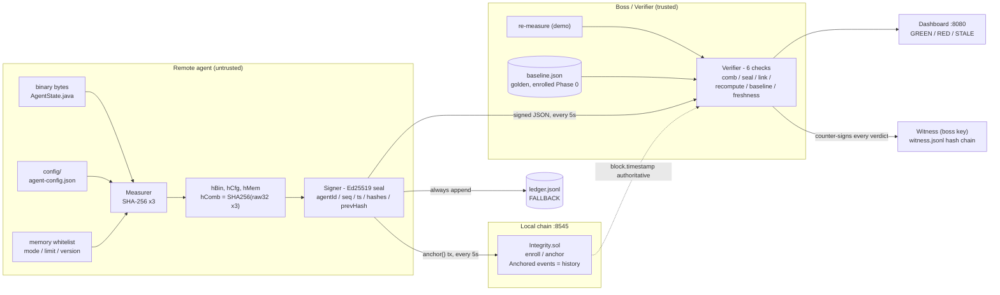
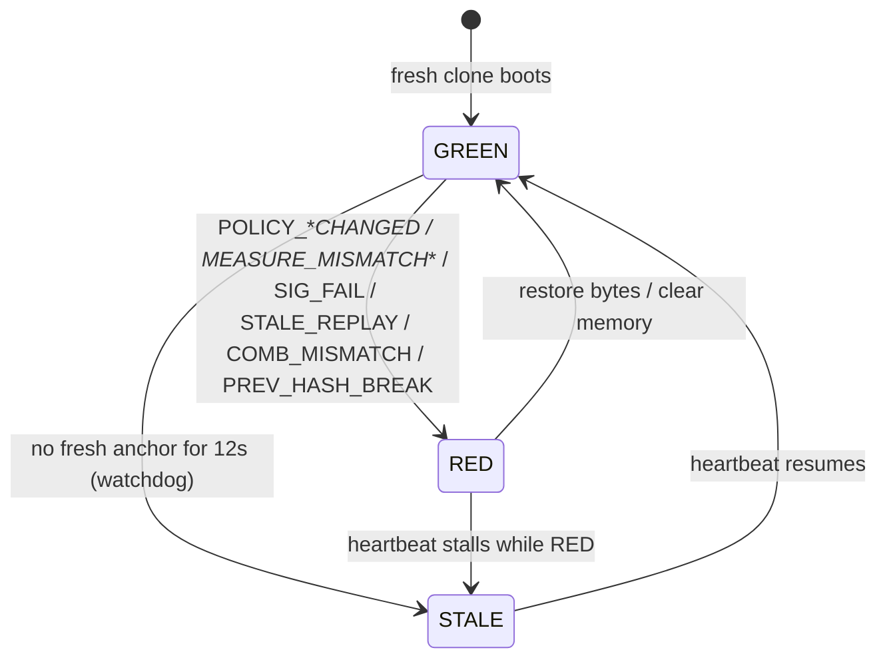

<h1 align="center">Decentralized Runtime Integrity Engine</h1>

<p align="center">
  <strong>Proof your remote agent hasn't been touched. No trust in the remote machine.</strong>
</p>

<p align="center">
  <a href="https://github.com/rajit2004/Decentralized-Runtime-Integrity-Engine-for-Remote-Agents/actions/workflows/ci.yml"></a>
  <a href="#testing--ci"></a>
  
  
  
  
</p>

---

## Contents

* [What is This?](#what-is-this)
* [Architecture](#architecture)
* [How It Works](#how-it-works)
* [Features](#features)
* [Tech Stack](#tech-stack)
* [Project Structure](#project-structure)
* [Quick Start](#quick-start)
* [Testing & CI](#testing--ci)
* [Verdict Codes](#verdict-codes)
* [Open Limits](#open-limits)
* [Contributing](#contributing)
* [Author](#author)

---

## What is This?

**Decentralized Runtime Integrity Engine** is a verifiable integrity framework for remote agents, built for Technorazz 2026, Track 1.6.

Remote agents (AI bots, edge workers, enterprise daemons) run where you can't see them. An attacker with file access can patch the binary, edit `config.json`, or flip an in-memory limit. We don't prevent the edit - we **prove it within one 5s interval plus ~4ms pipeline average (~24ms worst, measured over 20 trials), and flag STALE if no fresh anchor arrives after 12s.**

Every 5 seconds the Checker takes 3 fingerprints, seals them with Ed25519, and anchors them. The Boss re-measures (demo mode) and compares fresh fingerprints against the anchored log **and** against a golden baseline enrolled on day one.

> Chain proves *timeline*. Baseline proves *what good looks like*. You need both: chain alone would accept an honest Checker that anchors a hash of the attacker's edited file; baseline alone cannot prove order. The Verifier demands `H_recomputed == H_chain == H_baseline`.

Detect, don't prevent. Built with **pure JDK Java (no Maven downloads)**, **Solidity `Integrity.sol`**, and a **Hardhat local chain**.

---

## Architecture



| Box | Job | File |
|---|---|---|
| **Measurer** | 3 SHA-256 fingerprints + deterministic memory canonicalization | `measure/Measurer.java` |
| **Signer** | Ed25519 wax seal over the 8-field payload | `sign/Signer.java` |
| **Chain anchor** | Real `anchor()` tx every cycle, raw JSON-RPC (HTTP/1.1), Keccak + manual ABI in pure JDK | `chain/ChainAnchor.java`, `chain/Keccak.java`, `chain/Abi.java` |
| **Verifier** | 6 independent checks, per-component blame | `verify/Verifier.java` |
| **Witness** | Boss counter-attestation: own key, hash-chained `witness.jsonl` | `witness/Witness.java` |
| **Baseline** | Golden `hComb` from Phase 0 enrollment, never overwritten from chain | `config/baseline.json` |
| **Dashboard** | Status light + attack buttons + witness panel, JDK `HttpServer` | `ui/Dashboard.java`, `web/` |
| **Contract** | Diary: `enroll` once, `anchor` per cycle, history in events | `contract/contracts/Integrity.sol` |

---

## How It Works

```text
Phase 0 - Trusted Enrollment (once, clean room)
  Enroller measures golden files
        |
        v
  config/baseline.json saved (Boss trusted store) + genesis anchored
        |
        v
Phase 1 - Heartbeat (every 5s forever)
  Checker reads binary + config + memory
        |
        v
  H_bin, H_cfg, H_mem -> H_comb = SHA256(raw32 || raw32 || raw32)
        |
        v
  Sign(agentId|seq|ts|hBin|hCfg|hMem|hComb|prevHash) with keys/ privateKey
        |
        v
  Anchor to Integrity.sol (owner-only, block.timestamp) / ledger.jsonl FALLBACK
        |
        v
  Boss checks: comb valid? seal valid (off-chain)? prevHash chains?
  H_re == reported per-component? reported == baseline per-component?
  seq/ts fresh (chain time authoritative)?
        |
        v
  GREEN (all pass) or RED (reason + expected vs got)
        |
        v
  Dashboard :8080 + console log + witness.jsonl counter-attestation
```

### Verdict state machine



### Attack table

| Attack | Result |
|---|---|
| No attack | GREEN OK |
| Edit config, honest Checker | RED POLICY_CFG_CHANGED comp=config, sustained |
| Edit binary | RED POLICY_BIN_CHANGED comp=binary |
| Memory flip via endpoint | RED POLICY_MEM_CHANGED comp=memory |
| Lying Checker (anchor old) | RED MEASURE_MISMATCH_* comp=that component |
| Replay / reorder | RED STALE_REPLAY (seq/ts/prevHash) |
| Heartbeat stalled (locked/hung files) | RED CYCLE_ERR, then STALE after 12s via 1s watchdog. Demo: `scripts/demo-stale.ps1` |
| Kill the engine process | Page honestly shows "engine unreachable" (no stale green light) |
| Swap in a new key pair | RED KEY_MISMATCH comp=key (when baseline is pinned via Enroller) |
| Rewrite a witness.jsonl line | Witness panel flips BROKEN, chain verify fails |

---

## Features

* **Triple Fingerprinting** - every cycle hashes the binary (`AgentState.java`), `config/agent-config.json`, and whitelisted memory state with SHA-256. One byte change flips the whole hash.
* **Deterministic Memory Hashing** - no RAM dumps (too noisy). Only `mode, limit, version` serialized via sorted `TreeMap` to `k=v;k=v` canonical form, then hashed. Same state always gives the same hash, no false positives.
* **Golden Baseline Enrollment** - Phase 0 runs once in a clean room. `Enroller.java` captures `hBin/hCfg/hMem/hComb` into `config/baseline.json`, the Boss's trusted store, never overwritten from chain. Legit upgrades need a re-enrollment.
* **Wax-Seal Signatures (frozen)** - payload `agentId|seq|ts|hBin|hCfg|hMem|hComb|prevHash`, Ed25519 via `java.security` (no libs). All three component hashes covered, so the Boss can blame binary vs config vs memory. `hComb = SHA256(raw32||raw32||raw32)` (raw bytes, never hex-concat). `seq` + `prevHash` stop replay and forks.
* **Real On-Chain Anchoring (chain authoritative, file fallback)** - a real `anchor()` tx every cycle when `config/chain.json` + node are up (`ledgerRef` = tx hash, `block.timestamp` authoritative). `ledger.jsonl` is always appended so the demo survives node death. History lives in `Anchored` events. Ed25519 verified off-chain (EVM has none).
* **6-Check Verifier with per-component blame** - GREEN only if: `hComb == SHA256(raws)`, full seal valid, `prevHash` chains, `H_re == reported` per component (catches a lying Checker), `reported == baseline` per component (catches edits), and `ts` fresh + `seq` monotonic. RED names the reason and the component.
* **Key Pinning + Witness Audit** - enrollment pins the agent public key into `baseline.json` (a swapped key pair fails as `KEY_MISMATCH`); every verdict is counter-signed by a separate boss key into hash-chained `witness.jsonl`. A stolen agent key can forge agent signatures, but not the witness trail.
* **Live Dashboard** - JDK `HttpServer` on `:8080`, zero deps: big status light, timeline, donut, attack buttons, hash diff view, and the witness audit panel (live chain verification, entry count, head hash, last entry). Auto-refreshes every 2s.
* **Live Tamper Demo** - config edit flips `POLICY_CFG_CHANGED` next cycle; the memory endpoint flips `POLICY_MEM_CHANGED` with no file edit; restore returns GREEN with no restart. Easiest path: the dashboard's Tamper/Restore buttons.
* **Stale / Replay Guard** - rejects timestamps older than 12s (chain `block.timestamp` when up) and reused/rewound `seq`; `seq` persisted in `config/seq.dat` so restarts don't self-flag. A stalled heartbeat shows `CYCLE_ERR` with the cause first, then `STALE` after 12s (watchdog wins, no flicker).
* **Zero External Java Deps** - pure JDK 17+ (tested on 24). `javac` + `java` is enough: no Maven, Gradle, Spring, or web3j download. Perfect for hackathon wifi.
* **Scale: Merkle Batching** - collect a window of `hComb`, anchor one root/min, keep per-device proofs. 10k-leaf root in ~93ms. See `docs/SCALING.md`.
* **Measured Performance** - 20 trials: pipeline avg 4ms (measure 0.6, sign 1.6, verify 2.0), worst 24ms. Detection = next 5s interval + pipeline. See `docs/BENCHMARKS.md`.

---

## Tech Stack

| Layer | Technology |
|---|---|
| **Language** | Java 17+ (tested on 24), JDK only |
| **Crypto** | `MessageDigest SHA-256`, `Signature Ed25519` |
| **Chain** | Solidity 0.8.20 `Integrity.sol`, Hardhat local node (`:8545`) |
| **Chain Client** | Java `HttpClient` raw JSON-RPC (HTTP/1.1, no web3j), pure-JDK Keccak-256 + manual ABI encoder; `hardhat-ethers` deploy script |
| **Dashboard** | Java `HttpServer` on `:8080`, no framework + static `web/` UI |
| **Canonicalization** | Manual `TreeMap` sorted `k=v;` - no Jackson (SORT_KEYS trap avoided by design) |
| **Config** | `config/agent-config.json`, `config/baseline.json` (golden), `config/seq.dat` (persisted cursor), `config/chain.json` (deploy output, gitignored) |
| **Keys** | `keys/` outside writable `config/` (assumption stated; TPM/TEE real fix) |
| **Batch** | `batch/MerkleTree` root/min + proofs (10k scale) |
| **Fallback Ledger** | `ledger.jsonl` tamper-evident fallback (headHash in memory), chain event log authoritative |
| **Timing** | 5s interval, STALE after 12s, 1s watchdog; pipeline avg 4ms worst 24ms |
| **CI** | GitHub Actions: compile, `--release 17`, 54-check SelfTest, LF gate, live smoke test, contract build |

---

## Project Structure

```text
1.6/
├── .github/workflows/ci.yml    # gates every push/PR (see Testing & CI)
├── contract/
│   ├── contracts/Integrity.sol # diary: enroll() + anchor() + events
│   ├── hardhat.config.js
│   ├── package.json
│   └── scripts/deploy.js       # npm run deploy -> writes config/chain.json
├── java/src/integrity/         # 19 Java files, one job each
│   ├── Main.java               # heartbeat loop + wiring + watchdog
│   ├── measure/                # SHA-256 triple fingerprint + wire JSON
│   ├── sign/                   # Ed25519 seal, keys/ load-or-generate
│   ├── enroll/                 # Phase 0 golden capture + persisted seq
│   ├── chain/                  # real anchor() txs, Keccak, manual ABI
│   ├── verify/Verifier.java    # 6-check verifier + key pin
│   ├── witness/Witness.java    # boss counter-attestation, hash-chained
│   ├── batch/                  # MerkleTree + fleet benchmarks
│   ├── agent/AgentState.java   # dummy worker whitelisted state
│   ├── ui/Dashboard.java       # GREEN/RED page + API :8080
│   └── test/SelfTest.java      # 54-check regression suite
├── config/
│   ├── agent-config.json       # tamper target (edit live)
│   └── baseline.json           # golden baseline, Boss trusted store
├── web/                        # dashboard UI (app.js / index.html / styles.css)
├── scripts/                    # run.ps1, demo-tamper.ps1, demo-stale.ps1, redeploy.ps1
├── docs/                       # PITCH, BENCHMARKS, THREAT_MODEL, SCALING, ...
└── README.md
```

---

## Quick Start

**Prerequisites:** Java 17+ (`java -version`). Node 18+ + npm only for the optional chain. No Maven/Gradle.

### 1. Clone

```bash
git clone https://github.com/rajit2004/Decentralized-Runtime-Integrity-Engine-for-Remote-Agents.git
cd Decentralized-Runtime-Integrity-Engine-for-Remote-Agents
```

A fresh clone boots **GREEN immediately**: the golden baseline is committed, `keys/` auto-generate on first run, and `.gitattributes` pins LF line endings for the hashed files so bytes match on every OS.

### 2. Compile and Run (30 seconds to GREEN)

```powershell
javac -d out (Get-ChildItem -Recurse java/src/*.java)
java -cp out integrity.Main
```

Open <http://localhost:8080> - you should see GREEN flowing with cycle + tx.

### 3. Optional: real chain anchoring (recommended for judges)

```bash
cd contract
npm install
npx hardhat node --port 8545
# new terminal
npm run deploy        # writes ../config/chain.json (rpcUrl, contractAddr, from, gas)
```

Restart the engine after deploy - it enrolls once on-chain (`anchorCount==0`), then every heartbeat is a real `anchor()` tx (`chainUp=true`, `ledgerRef` = tx hash). If the chain is down, the engine still runs with `chainUp=false` + `ledger.jsonl`.

### 4. Tamper Live (the demo)

1. Open `config/agent-config.json`, change `"threshold": 100` to `999`, save.
2. Next cycle flips RED: `POLICY_CFG_CHANGED comp=config` (sustained). Restore to `100` and GREEN returns next cycle. Memory variant: `/tamper/memory?limit=999` -> `POLICY_MEM_CHANGED` with no file edit.
3. Byte-safety: prefer the dashboard's Tamper/Restore buttons (they never touch line endings). Stuck RED after a manual save? `git checkout -- config/agent-config.json` restores byte-identical bytes -> GREEN next cycle.

Show judges `baseline.json` on screen before step 1 - that proves what good is.

### Re-baseline (only when you intentionally changed source/config)

```powershell
javac -d out (Get-ChildItem -Recurse java/src/*.java)
java -cp out integrity.enroll.Enroller "java/src/integrity/agent/AgentState.java" "config/agent-config.json"
# check config/baseline.json -> hComb golden
```

Never auto-overwrite the baseline from chain. Running `Enroller` also pins the current agent public key into the baseline (key swap protection).

---

## Testing & CI

### SelfTest - 54 checks, pure JDK, exit 1 on failure

```powershell
javac -d out (Get-ChildItem -Recurse java/src/*.java)
java -cp out integrity.test.SelfTest
```

Covers:

* Keccak-256 vectors + all 4 function selectors (verified against `ethers`)
* Ed25519 roundtrip, tampered field, wrong `seq`, corrupted signature
* Raw-bytes `hComb` rule (and that hex-concat is a *different* wrong value)
* Full attack table: `OK`, `POLICY_BIN/CFG/MEM_CHANGED`, `MEASURE_MISMATCH_BIN/CFG/MEM`, `SIG_FAIL`, `COMB_MISMATCH`, `PREV_HASH_BREAK`, `STALE_REPLAY` (old ts + seq reuse)
* Sustained-tamper regression (POLICY stays POLICY across cycles, recovery -> OK)
* Key pinning: key swap -> `KEY_MISMATCH`, pin present + matching key -> OK, legacy unpinned baseline still boots
* Witness: 3-line chain verifies, edited line breaks the chain, wrong boss key rejected
* Merkle 10k-leaf build under budget + proof verify/reject
* ABI layout: selectors, string offsets, seq word, sig offset
* `SeqStore` roundtrip and genesis default

### CI - every push and PR (`.github/workflows/ci.yml`)

| Gate | Catches |
|---|---|
| `javac` full build | compile breakage |
| `javac --release 17` | accidental Java 18+ APIs |
| `SelfTest` (54 checks) | verifier/crypto/chain regressions |
| `node --check web/app.js` | dashboard JS syntax |
| `git ls-files --eol` on the 2 hashed files | LF/CRLF baseline portability break |
| Live smoke: boot -> must reach GREEN | fresh-clone boot regression |
| Live smoke: tamper -> RED `POLICY_CFG_CHANGED` -> restore -> GREEN | verdict regression |
| `npx hardhat compile` | Solidity breakage |

---

## Verdict Codes

All from `Verifier.java`:

* `OK` - all checks pass, GREEN
* `KEY_MISMATCH` - the signing key on disk is not the one pinned in `baseline.json` at enrollment (key-swap attack; component: key)
* `SIG_FAIL` - full 8-field seal invalid (Boss verifies off-chain; EVM has no Ed25519). Malformed base64/length also lands here - verify never throws.
* `MEASURE_MISMATCH_BIN/CFG/MEM` - Boss recompute vs reported diverge per component (lying Checker/MITM)
* `POLICY_BIN/CFG/MEM_CHANGED` - honest report but dirty vs golden baseline per component
* `COMB_MISMATCH` - `hComb != SHA256(raws)`
* `PREV_HASH_BREAK` - missing/forked cycle (chain linkage)
* `STALE_REPLAY` - old `block.timestamp`-checked time or reused `seq`
* `CYCLE_ERR` - heartbeat exception (cause shown); promotes to `STALE` past the 12s window

Contract API (`Integrity.sol`, owner-only, `block.timestamp` authoritative):

* `enroll(agentId, hBin, hCfg, hMem, hComb)` - once, cycle 0 genesis, sets `ownerOf`
* `anchor(agentId, seq, hBin, hCfg, hMem, hComb, prevHash, sig)` - heartbeat, `require(msg.sender==owner)`, `prevHash` linkage
* `getLatest(agentId)` / `anchorCount(agentIdHash)` - reads
* Events (history lives here; mapping holds latest only): `Enrolled(bytes32 indexed agentIdHash, ...)`, `Anchored(bytes32 indexed agentIdHash, ...)`

---

## Open Limits

An honest statement of what this system does and does not cover.

### Software-only by design

The engine proves tampering when the agent is honest or when we can re-measure, but a fully compromised agent with a stolen signing key can lie. Closing that gap requires hardware: TPM/TEE key sealing, remote attestation, and chip-signed measurements.

What the software layer does close: key swaps (`KEY_MISMATCH`, enforced by the public key pinned into `baseline.json` at enrollment) and forgeable history (boss-signed, hash-chained `witness.jsonl` that a stolen agent key cannot rewrite).

A compromised Checker can sign false hashes with a stolen key; TPM/TEE is the path to closing that. In split deployments, keep the witness key on the Boss host only. This single-box demo keeps both keys on the same machine.

### Demo simplifications

* **Boss file re-read** works because the demo runs on a single machine; a remote verifier would use only the signed measurement, baseline, and chain.
* **Memory hashing** covers `AgentState{mode,limit,version}` (a whitelist), not the full heap, which never stabilizes across runs.
* **`ledger.jsonl`** is a tamper-evident fallback; the chain event log is authoritative.

### Stack and demo scope

* **JDK-only** (`javac`/`java`, no Maven/Spring/Gradle/Javalin/web3j wrapper required).
* **Binary tamper** is secondary on Windows (locked JAR / classes directory); the config edit and memory endpoint are the live attack demos.
* **File reads** retry for 200ms; a missing file counts as tamper.

### Stretch goals

Split the Checker and Boss onto separate hosts, hold keys in a TPM/HSM, keep the baseline and public key in a Boss-controlled vault, anchor to a real L2 or permissioned chain, add Prometheus metrics, and adopt full TPM/TEE attestation.

---

## Contributing

Logical commits only, one feature = one commit. No amend, no force-push. Never commit `keys/*.pkcs8`, `keys/*.x509`, or real `*.key` files - demo keys generate once into ignored `keys/`. CI must pass before merge (see [Testing & CI](#testing--ci)).

```bash
git checkout -b feat/amazing-check
git commit -m "feat(verify): explain policy mismatch better"
git push origin feat/amazing-check
```

---

## License

Distributed under the **MIT License**.

---

## Acknowledgements

**Hardhat** for the local chain + deploy tooling, the **Java JDK** (`MessageDigest`, `Ed25519`, `HttpClient`, `HttpServer`) for a zero-dep MVP, and the **Technorazz team** for the Track 1.6 problem statement.

---

# Author


**Ranesh Rajit**
B.Tech Computer Science Student, India


[](https://github.com/rajit2004)


[](https://linkedin.com/in/ranesh-kun)
