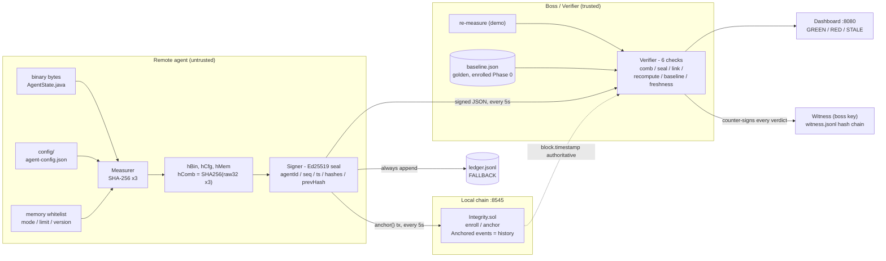
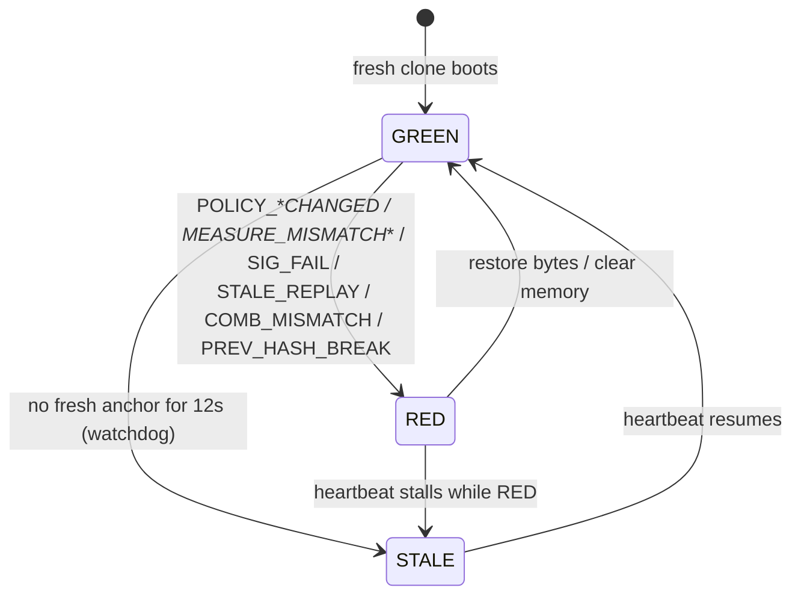

<h1 align="center">Decentralized Runtime Integrity Engine</h1>

<p align="center">
  <strong>Proof your remote agent hasn't been touched. No trust in the remote machine.</strong>
</p>

<p align="center">
  <a href="https://github.com/rajit2004/Decentralized-Runtime-Integrity-Engine-for-Remote-Agents/actions/workflows/ci.yml"></a>
  <a href="#features"></a>
  <a href="#how-it-works"></a>
  <a href="#tech-stack"></a>
  <a href="#project-structure"></a>
  <a href="#quick-start"></a>
  <a href="#testing--ci"></a>
</p>

<p align="center">
  
  
  
  
</p>

---

## Contents

* [What is This?](#what-is-this)
* [Architecture](#architecture)
* [Features](#features)
* [How It Works](#how-it-works)
* [Tech Stack](#tech-stack)
* [Project Structure](#project-structure)
* [Quick Start](#quick-start)
* [Testing & CI](#testing--ci)
* [Verdict Codes](#verdict-codes)
* [Deployment](#deployment)
* [Open Limits](#open-limits-volunteer-before-judges-ask)

---

## What is This?

**Decentralized Runtime Integrity Engine** is a verifiable integrity framework for remote agents built for Technorazz 2026, Track 1.6.

Remote agents - AI bots, edge workers, enterprise daemons - run where you can't see them. An attacker with file access can patch the binary, edit `config.json`, or flip an in-memory limit. How do you know?

We don't prevent the edit. We **prove it within one 5s interval plus ~4ms pipeline avg (~24ms worst, measured 20 trials). STALE if no fresh anchor after 12s.**

Every 5 seconds the Checker takes 3 fingerprints, seals them, pastes them in the chain event log (authoritative; `ledger.jsonl` is a tamper-evident FALLBACK, not tamper-proof), and the Boss compares fresh fingerprints against that log **and** against a golden baseline enrolled on day one.

> Chain proves *timeline*. Baseline proves *what good looks like*. You need both.

If you only check chain, an honest Checker anchoring a new edited hash would still look GREEN. That's the hole judges will probe. We fixed it: Boss requires `H_recomputed == H_chain == H_baseline`.

Built with **pure JDK Java (no Maven downloads)**, **Solidity `Integrity.sol`**, and a **Hardhat local chain**.

---

## Architecture



| Box | Job | File |
|---|---|---|
| **Measurer** | 3 SHA-256 fingerprints + deterministic memory canonicalization | `measure/Measurer.java` |
| **Signer** | Ed25519 wax seal over the 8-field payload | `sign/Signer.java` |
| **Chain anchor** | Real `anchor()` tx every cycle, raw JSON-RPC (HTTP/1.1), Keccak + manual ABI in pure JDK | `chain/ChainAnchor.java`, `chain/Keccak.java`, `chain/Abi.java` |
| **Verifier** | 6 independent checks, per-component blame | `verify/Verifier.java` |
| **Witness** | Boss counter-attestation: own key, hash-chained `witness.jsonl` | `witness/Witness.java` |
| **Baseline** | Golden `hComb` from Phase 0 enrollment, never overwritten from chain | `config/baseline.json` |
| **Dashboard** | Status light + attack buttons, JDK `HttpServer` | `ui/Dashboard.java`, `web/` |
| **Contract** | Diary: `enroll` once, `anchor` per cycle, history in events | `contract/contracts/Integrity.sol` |

Why baseline **and** chain: chain alone can't tell "new honest measurement" from "honest Checker anchoring a hash of the attacker's edited file". Baseline alone can't prove *when* things happened or order. The Verifier demands both.

---

## Features

### Core Features

* **Triple Fingerprinting**
  Every cycle hashes the agent binary file, `config/agent-config.json`, and whitelisted memory state (`mode, limit, version`). Uses `MessageDigest SHA-256`. One byte change flips the whole hash.

* **Deterministic Memory Hashing**
  We don't dump RAM - that's noisy. We serialize only critical variables via sorted `TreeMap` to `k=v;k=v` canonical form, then hash. Same state always gives same hash, no false positives.

* **Golden Baseline Enrollment**
  Phase 0 runs once in a clean room. `Enroller.java` captures `H_bin0, H_cfg0, H_mem0, H_comb0` into `config/baseline.json`. That file is the Boss's trusted store, never overwritten from chain. Legit upgrades need a new admin-signed enrollment.

* **Wax-Seal Signatures (frozen)**
  Payload `agentId|seq|ts|hBin|hCfg|hMem|hComb|prevHash` is signed with Ed25519 (`java.security`, no libs). All three component hashes covered, so Boss can blame binary vs config vs memory. `hComb = SHA256(raw32||raw32||raw32)` - raw bytes, never hex-concat (SelfTest pins the difference). Timestamp + monotonic `seq` + `prevHash` chain stops replay/fork.

* **Real On-Chain Anchoring (chain authoritative, file fallback)**
  `ChainAnchor.java` sends a real `anchor()` tx every cycle when `config/chain.json` + node are up (`ledgerRef` = tx hash, chain `block.timestamp` authoritative), and appends to `ledger.jsonl` FALLBACK always so the demo survives node death. History lives in `Anchored` events (event log); mapping holds latest only. Ed25519 verified OFF-CHAIN by Boss (EVM has none). File ledger is tamper-evident, not tamper-proof - Verifier `headHash()` memory catches rewrites within a run.

* **Judge-Proof Verifier (per-component blame)**
  `Verifier.java` loads golden `hBin/hCfg/hMem/hComb` once (immutable). GREEN only if: 1) `hComb==SHA256(raws)`, 2) full 8-field seal valid, 3) `prevHash` chains, 4) `H_re==reported` per-component (catches lying Checker as `MEASURE_MISMATCH_BIN/CFG/MEM`), 5) `reported==baseline` per-component (catches edit as `POLICY_BIN/CFG/MEM_CHANGED`), 6) `ts` fresh + `seq` monotonic.

* **Live GREEN / RED Dashboard**
  JDK `HttpServer` on `:8080`, zero deps. Big status light, cycle count, tx hash, expected-baseline vs observed vs chain (truncated), detail line with timings, donut/timeline/presenter views, and a witness audit panel (live chain verification, entry count, head hash, last entry). Auto-refreshes every 2s. This is what judges stare at.

* **Live Tamper Demo (3 flavors)**
  Config: edit `config/agent-config.json` `100->999`, save. Next 5s cycle flips RED `POLICY_CFG_CHANGED comp=config`. Memory: open `/tamper/memory?limit=999` (no file edit) -> RED `POLICY_MEM_CHANGED`. Binary: main demo is config (JAR locked on Windows; test binary tamper on Linux/macOS or stopped agent). Restore -> GREEN. No restart.

* **Lying-Checker Detection**
  If Checker anchors old good hash while files dirty, Boss independent recompute (demo only - remote has signed measurement only) catches `MEASURE_MISMATCH_BIN/CFG/MEM` and names the component. Two measure calls per cycle.

* **Key Pinning + Witness Audit (anti key-theft software layer)**
  Enrollment pins the agent's public key into `baseline.json`; a swapped key pair fails as `KEY_MISMATCH` instead of self-verifying into GREEN (re-run Enroller to activate the pin). Every verdict is also counter-signed by a separate boss witness key into hash-chained `witness.jsonl`, so a stolen agent key can forge agent signatures but not the witness trail. What this closes in software: key swaps and post-hoc forgery evidence. What needs hardware: a live stolen key (TPM/TEE, see Open Limits).

* **Keys Outside Writable Dir (stated assumption)**
  Private key in `keys/` (locked perms where OS allows), NOT next to `config.json`. A box-reader can still steal it - TPM/TEE is the real fix (stretch). Stated openly, see `docs/THREAT_MODEL.md`.

* **Metrics on Every Cycle (measured, not promised)**
  20 trials: pipeline avg 4ms (measure 0.6, sign 1.6, verify 2.0), worst 24ms. Detection = next 5s interval + pipeline. STALE after 12s via 1s watchdog. Batch: 10k-leaf root 93ms, 1 root/min = 0.0167 TPS vs naive 2000 TPS (120,000x). See `docs/BENCHMARKS.md`.

* **Scale: Merkle Batching**
  Fleet fix: collect window of `hComb`, anchor one root/min, keep per-device proofs. Demo heartbeat stays 5s; batch path proves 10k scale. See `docs/SCALING.md`.

### Reliability and Safety

* **No External Java Deps**
  Pure JDK 17+ (runs on 24). No Maven, Gradle, Spring, or web3j download needed for MVP. `javac` + `java` is enough. Perfect for hackathon wifi.

* **Chain Fallback**
  With `config/chain.json` (written by `npm run deploy`) and the node up, every heartbeat is a real `anchor()` transaction: `ledgerRef` = tx hash, chain `block.timestamp` authoritative (`chainUp=true`). If the node is down, engine keeps running on `ledger.jsonl` fallback and marks `chainUp=false`. You lose decentralization points but keep 35% demo marks.

* **Stale / Replay Guard**
  Rejects timestamps older than 12s (chain `block.timestamp` authoritative when up) and reused/rewound `seq`. Attacker can't resend last week's good cover. `seq` persisted in `config/seq.dat` so restarts don't self-flag REPLAY. A stalled heartbeat shows `CYCLE_ERR` with the cause first, then `STALE` after 12s (watchdog wins - no flicker).

* **Windows-Safe Paths**
  Hashes `AgentState.java` source + config instead of locked `.exe`. Avoids file-lock false REDs on Windows demo laptops.

### Design Choices

* **Detect, Don't Prevent**
  We state this upfront. Threat model: attacker can write files, can't steal private key, can't rewrite chain history, can't rewrite Boss baseline store.

* **Small Attack Surface**
  One job per file, 18 Java files + 1 Solidity file. Easy for any teammate to explain heartbeat in viva.

---

## How It Works

```text
Phase 0 - Trusted Enrollment (once)
  Clean room -> Enroller measures golden files
        |
        v
  config/baseline.json saved with Boss + genesis anchored
        |
        v
Phase 1 - Heartbeat (every 5s forever)
  Checker reads binary + config + memory
        |
        v
  H_bin, H_cfg, H_mem -> H_comb=SHA256(raw32||raw32||raw32)
        |
        v
  Sign(agentId|seq|ts|hBin|hCfg|hMem|hComb|prevHash) with keys/ privateKey
        |
        v
  Anchor full JSON to Integrity.sol (owner-only, block.timestamp) / ledger.jsonl FALLBACK
        |
        v
  Boss independent recompute, demo only (remote has signed measurement only) -> H_re
        |
        v
  Checks: comb valid? full seal valid (off-chain)? prevHash chains? H_re==reported per-component? reported==baseline per-component? seq/ts fresh (chain time authoritative)?
        |
        v
  GREEN (all pass) or RED (reason + expected vs got)
        |
        v
  Dashboard :8080 + console log
```

### Verdict state machine



Attack table for viva:

| Attack | Result |
|---|---|
| No attack | GREEN OK |
| Edit config, honest Checker | RED POLICY_CFG_CHANGED comp=config, sustained |
| Edit binary | RED POLICY_BIN_CHANGED comp=binary |
| Memory flip via endpoint | RED POLICY_MEM_CHANGED comp=memory |
| Lying Checker (anchor old) | RED MEASURE_MISMATCH_* comp=that component |
| Replay / reorder | RED STALE_REPLAY (seq/ts/prevHash) |
| Heartbeat stalled (locked/hung files) | RED CYCLE_ERR, then STALE after 12s via 1s watchdog (headHash shown). Demo: `scripts/demo-stale.ps1` |
| Kill the engine process | Page honestly shows "engine unreachable" (no stale green light) |

---

## Tech Stack

| Layer | Technology |
|---|---|
| **Language** | Java 17+ (tested on 24), JDK only |
| **Crypto** | `MessageDigest SHA-256`, `Signature Ed25519` |
| **Chain** | Solidity 0.8.20 `Integrity.sol`, Hardhat local node (`:8545`) |
| **Chain Client** | Java `HttpClient` raw JSON-RPC (HTTP/1.1, no web3j), pure-JDK Keccak-256 + manual ABI encoder; `hardhat-ethers` deploy script |
| **Dashboard** | Java `HttpServer` on `:8080`, no framework + static `web/` UI |
| **Canonicalization** | Manual `TreeMap` sorted `k=v;` - no Jackson (SORT_KEYS trap avoided by design) |
| **Config** | `config/agent-config.json`, `config/baseline.json` (golden), `config/seq.dat` (persisted cursor), `config/chain.json` (deploy output, gitignored) |
| **Keys** | `keys/` outside writable `config/` (assumption stated; TPM/TEE real fix) |
| **Batch** | `batch/MerkleTree` root/min + proofs (10k scale) |
| **Fallback Ledger** | `ledger.jsonl` FALLBACK tamper-evident (headHash in memory), chain event log authoritative |
| **Timing** | 5s interval, STALE after 12s, 1s watchdog; pipeline avg 4ms worst 24ms |
| **CI** | GitHub Actions: compile, `--release 17`, 54-check SelfTest, LF gate, live smoke test, contract build |

---

## Project Structure

```text
1.6/
├── .github/workflows/ci.yml    # gates every push/PR (see Testing & CI)
├── contract/
│   ├── contracts/Integrity.sol # diary: enroll() + anchor() + events
│   ├── hardhat.config.js
│   ├── package.json
│   └── scripts/deploy.js       # npm run deploy -> writes config/chain.json
├── java/src/integrity/
│   ├── Main.java               # heartbeat loop + wiring + watchdog
│   ├── measure/
│   │   ├── Measurer.java       # SHA-256 triple fingerprint
│   │   └── SignedMeasurement.java  # wire JSON (frozen 10 fields)
│   ├── sign/
│   │   ├── Signer.java         # Ed25519 seal + verify (total, never throws)
│   │   └── KeyStore.java       # keys/ load-or-generate
│   ├── enroll/
│   │   ├── Enroller.java       # Phase 0 golden capture
│   │   └── SeqStore.java       # persisted seq cursor
│   ├── chain/
│   │   ├── ChainAnchor.java    # real anchor() txs + ledger.jsonl fallback
│   │   ├── Keccak.java         # pure-JDK Keccak-256 (selectors vs ethers)
│   │   └── Abi.java            # manual ABI encoder (enroll/anchor/reads)
│   ├── verify/Verifier.java    # 6-check judge-proof verifier + key pin
│   ├── witness/Witness.java    # boss counter-attestation, hash-chained
│   ├── batch/                  # MerkleTree + fleet benchmarks
│   ├── agent/AgentState.java   # dummy worker whitelisted state
│   ├── ui/Dashboard.java       # GREEN/RED page + API :8080
│   └── test/SelfTest.java      # 54-check regression suite
├── config/
│   ├── agent-config.json       # tamper target (edit live)
│   └── baseline.json           # golden baseline, Boss trusted store
├── web/                        # dashboard UI (app.js / index.html / styles.css)
├── scripts/
│   ├── run.ps1                 # build + run
│   ├── demo-tamper.ps1         # CRLF-safe config tamper/restore
│   ├── demo-stale.ps1          # STALE demo (locks heartbeat)
│   └── redeploy.ps1
├── docs/                       # PITCH, BENCHMARKS, THREAT_MODEL, SCALING, ...
└── README.md
```

---

## Quick Start

### Prerequisites

* Java 17+ (`java -version`)
* Node 18+ + npm (only for chain; optional - fallback demo works without it)
* No Maven/Gradle needed

### 1. Clone

```bash
git clone https://github.com/rajit2004/Decentralized-Runtime-Integrity-Engine-for-Remote-Agents.git
cd Decentralized-Runtime-Integrity-Engine-for-Remote-Agents
```

A fresh clone boots **GREEN immediately**: the golden baseline is committed, `keys/` auto-generate on first run, and `.gitattributes` pins LF line endings for the hashed files so bytes match on every OS.

### 2. Compile and Run (30 seconds to GREEN)

```powershell
javac -d out (Get-ChildItem -Recurse java/src/*.java)
java -cp out integrity.Main
```

Open <http://localhost:8080> - you should see GREEN flowing with cycle + tx.

### 3. Optional: real chain anchoring (recommended for judges)

```bash
cd contract
npm install
npx hardhat node --port 8545
# new terminal
npm run deploy        # hardhat run scripts/deploy.js --network localhost
# writes ../config/chain.json (rpcUrl, contractAddr, from, gas)
```

Restart the engine after deploy - it reads `config/chain.json`, enrolls once on-chain (`anchorCount==0`), then every 5s heartbeat is a real `anchor()` tx (`chainUp=true`, `ledgerRef` = tx hash). If chain is down, engine still runs with `chainUp=false` + `ledger.jsonl`.

### 4. Tamper Live (the demo)

1. Open `config/agent-config.json`, change `"threshold": 100` to `999`, save.
2. Next 5s cycle flips RED: `POLICY_CFG_CHANGED comp=config` (sustained, not one-off). Worst-case detection = 5s + 24ms pipeline; heartbeat stall → CYCLE_ERR, STALE after 12s (`scripts/demo-stale.ps1`).
3. Restore to `100`, save. Back to GREEN next cycle. Memory variant: open `/tamper/memory?limit=999` -> `POLICY_MEM_CHANGED` without file edit.

> **Byte-safety tips (demo insurance):**
> * Easiest: use the dashboard's **Tamper/Restore buttons** - they edit only the value and never touch line endings.
> * If editing manually, use an editor that preserves line endings (VS Code, IntelliJ, Windows 11 Notepad). A CRLF-rewriting editor changes the file's bytes even with `threshold` back at `100`, and the engine will **correctly** stay RED (proof: bytes *did* change).
> * Stuck RED after a bad save? `git checkout -- config/agent-config.json` restores byte-identical bytes -> GREEN next cycle.

Show judges `baseline.json` on screen before step 4 - that proves what good is. Volunteer limits first: compromised Checker can sign lies (TPM/TEE stretch), Boss re-read is demo-only, memory = whitelisted map.

### Re-baseline (only when you intentionally changed source/config)

```powershell
javac -d out (Get-ChildItem -Recurse java/src/*.java)
java -cp out integrity.enroll.Enroller "java/src/integrity/agent/AgentState.java" "config/agent-config.json"
# check config/baseline.json -> hComb golden
```

Never auto-overwrite the baseline from chain.

---

## Testing & CI

### SelfTest - 54 checks, pure JDK, exit 1 on failure

```powershell
javac -d out (Get-ChildItem -Recurse java/src/*.java)
java -cp out integrity.test.SelfTest
```

Covers:

* Keccak-256 vectors + all 4 function selectors (verified against `ethers`)
* Ed25519 roundtrip, tampered field, wrong `seq`, corrupted signature
* Raw-bytes `hComb` rule (and that hex-concat is a *different* wrong value)
* Full attack table: `OK`, `POLICY_BIN/CFG/MEM_CHANGED`, `MEASURE_MISMATCH_BIN/CFG/MEM`, `SIG_FAIL`, `COMB_MISMATCH`, `PREV_HASH_BREAK`, `STALE_REPLAY` (old ts + seq reuse)
* Sustained-tamper regression (POLICY stays POLICY across cycles, recovery → OK)
* Key pinning: key swap → `KEY_MISMATCH`, pin present + matching key → OK, legacy unpinned baseline still boots
* Witness: 3-line chain verifies, edited line breaks the chain, wrong boss key rejected
* Merkle 10k-leaf build under budget + proof verify/reject
* ABI layout: selectors, string offsets, seq word, sig offset
* `SeqStore` roundtrip and genesis default

### CI - every push and PR (`.github/workflows/ci.yml`)

| Gate | Catches |
|---|---|
| `javac` full build | compile breakage |
| `javac --release 17` | accidental Java 18+ APIs |
| `SelfTest` (54 checks) | verifier/crypto/chain regressions |
| `node --check web/app.js` | dashboard JS syntax |
| `git ls-files --eol` on the 2 hashed files | LF/CRLF baseline portability break |
| Live smoke: boot → must reach GREEN | fresh-clone boot regression |
| Live smoke: tamper → RED `POLICY_CFG_CHANGED` → restore → GREEN | verdict regression |
| `npx hardhat compile` | Solidity breakage |

---

## Verdict Codes

All from `Verifier.java`:

* `OK` - all checks pass, GREEN
* `KEY_MISMATCH` - the signing key on disk is not the one pinned in `baseline.json` at enrollment (key-swap attack; component: key)
* `SIG_FAIL` - full 8-field seal invalid (Boss verifies off-chain; EVM has no Ed25519). Malformed base64/length also lands here - verify never throws.
* `MEASURE_MISMATCH_BIN/CFG/MEM` - Boss recompute vs reported diverge per-component (lying Checker/MITM)
* `POLICY_BIN/CFG/MEM_CHANGED` - honest report but dirty vs golden baseline per-component
* `COMB_MISMATCH` - `hComb != SHA256(raws)`
* `PREV_HASH_BREAK` - missing/forked cycle (chain linkage)
* `STALE_REPLAY` - old `block.timestamp`-checked time or reused `seq`
* `CYCLE_ERR` - heartbeat exception (cause shown); promotes to `STALE` past the 12s window

Contract API (`Integrity.sol`, owner-only, `block.timestamp` authoritative):

* `enroll(agentId, hBin, hCfg, hMem, hComb)` - once, cycle 0 genesis, sets `ownerOf`
* `anchor(agentId, seq, hBin, hCfg, hMem, hComb, prevHash, sig)` - heartbeat, `require(msg.sender==owner)`, `prevHash` linkage
* `getLatest(agentId)` / `anchorCount(agentIdHash)` - reads
* Events (history lives here; mapping holds latest only): `Enrolled(bytes32 indexed agentIdHash, ...)`, `Anchored(bytes32 indexed agentIdHash, ...)`

---

## Deployment

Demo laptop is production for hackathon.

```powershell
# build
javac -d out (Get-ChildItem -Recurse java/src/*.java)
# run
java -cp out integrity.Main
```

For real deployment (beyond hackathon): split Checker and Boss onto separate hosts, store private key in TPM/HSM, store baseline + public key in Boss vault, run Anvil/Hardhat as real L2 or permissioned chain, add Prometheus metrics. See Stretch: real TPM/TEE attestation, low-overhead measurement, secret sealing.

---

## Contributing

Logical commits only, no dumps. One feature = one commit.

```bash
git checkout -b feat/amazing-check
git commit -m "feat(verify): explain policy mismatch better"
git push origin feat/amazing-check
```

New commits only - no amend, no force-push. Never commit `keys/*.pkcs8`, `keys/*.x509`, or real `*.key` files. Demo keys generate once into ignored `keys/`.

CI must pass before merge: every push runs compile + SelfTest + live smoke test (see [Testing & CI](#testing--ci)).

---

## License

Distributed under the **MIT License**.

---

## Acknowledgements

* **Hardhat** for the local chain + deploy tooling
* **Java JDK** `MessageDigest`, `Ed25519`, `HttpClient`, `HttpServer` - zero-dep MVP
* **Technorazz 2026 Technorazz team** for Track 1.6 problem statement

---

## Author

**Rajit + Team**
Track 1.6 - Decentralized Runtime Integrity Engine for Remote Agents

[](https://github.com/rajit2004/Decentralized-Runtime-Integrity-Engine-for-Remote-Agents)

> One-liner for viva: *"Sig covers all three hashes plus seq/ts/prevHash. Chain proves order, baseline proves good. We name binary vs config vs memory. Limits: Checker can lie without TPM, re-read is demo-only, memory is a whitelist."*

## IntelliJ Troubleshooting

`Error: Could not find or load main class integrity.Main` with no `-classpath` in the launch line means IntelliJ's Make produced nothing. Fix in order:

1. `File -> Project Structure -> Project`: SDK must be JDK 24 (Add SDK -> JDK home `C:\Program Files\Java\jdk-24` if missing). Language level 24.
2. `Modules -> 1.6 -> Sources`: `java/src` must be blue (Sources). If not, right-click -> Mark as Sources Root.
3. `Build -> Rebuild Project`. Verify `out/production/1.6/integrity/Main.class` exists (terminal builds use `out/integrity/`, a different folder - both can coexist).
4. Run config `Run-Engine`: "Use classpath of module: 1.6", Before Launch: Build.
5. Re-run. Fallback that always works: `scripts/run.ps1` in a terminal (all live GREEN/RED tests ran that way).

## Open Limits (volunteer before judges ask)

* **Software-only solution - state it first.** It proves tampering when the agent is honest or when we can re-measure, but a fully compromised agent with a stolen key can lie. Closing that gap needs hardware: TPM/TEE key sealing, remote attestation, and chip-signed measurements. What the software layer does close: key swaps (`KEY_MISMATCH` via the pin written at enrollment) and forgeable history (boss-signed, hash-chained `witness.jsonl` that a stolen agent key cannot rewrite).
* Compromised Checker can sign false hashes with a *stolen* key - TPM/TEE is the stretch goal. In split deployments keep the witness key on the Boss host only; in this single-box demo both keys sit on the same machine (stated).
* Boss file re-read works because demo is one laptop; remote verifier uses signed measurement + baseline + chain only.
* Memory = `AgentState{mode,limit,version}` whitelist, not heap (heap never stabilizes).
* `ledger.jsonl` is FALLBACK tamper-evident; chain event log authoritative.
* Stack: JDK-only MVP (`javac`/`java`, no Maven/Spring/Gradle/Javalin/web3j wrapper needed). Binary tamper is secondary on Windows (JAR locked / classes dir); config + memory endpoint are the live demos. File reads retry 200ms; missing file = tamper.
